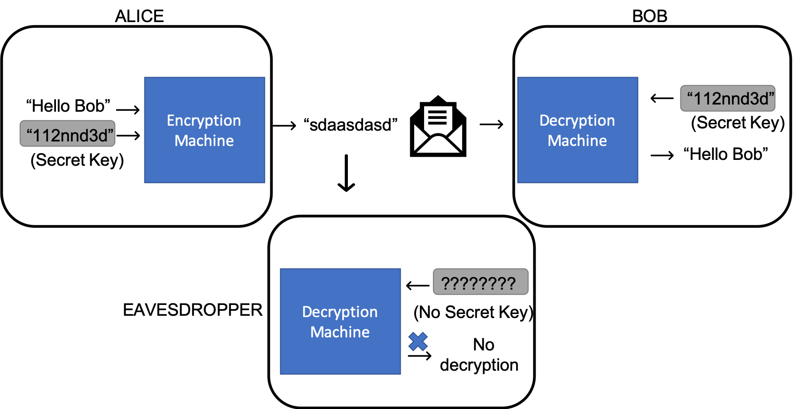

Topics over lunch is written with the motivation of bringing fascinating topics in Computer Science to a general audience.

# Table of Contents
1. [Encryption over lunch](#encryption-over-lunch)

## Encryption over lunch

The subject of Crytography has always been the subject of much media speculation and public interest, and has suffered the degree of distortion guaranteed of such topics. To an uninformed reader, it may appear that any meaningful understanding of Cryptography requires a strong mathematical background. While this is certainly true of those aspiring to work with such systems, some valuable insights and ideas are conveyed well regardless of subject training.

### What is the problem?

We begin by characterising the problem that motivates some well known Cryptographic protocols. Suppose that two individuals Alice and Bob wish to communicate with each other through some medium (letters, perhaps), on some important matters. The problem arises that this communication could be attacked a malicious party, who decides to: 

- spy on the communication, hence compromising the **confidentiality** of the conversation
- forge messages in the communication, hence compromising the **authenticity** of messages
- seize all letters from the mailbox and preventing their delivery, hence compromising the **availability** of a communication system

It is easy to see that parties with truly malicious intent could cause damage by interfering in private communications such as those between a client and a bank, for example. Cryptography focuses on the former two of these problems; there is not much meaning to exploring any communication system when messages are arbitrarily stolen. 

### Protecting message privacy

We now set about the task of exploring systems that satisfy these requirements, step by step. As a first step we attempt to find a way to protect the confidentiality over the message. Suppose that Alice wishes to share with Bob a message `m = "Hello Bob"`. Sharing this message in its current form, would of course allow any eavesdropper gain the complete meaning of the message. 

However, suppose that we applied some transformation (called encryption) upon this message m, which resulted in some other seemingly unrelated string,(perhaps `and1c3de5jd` or any other string you can write down) and only shared this over the communication system. Unless the eavesdropper had knowledge of the exact way in which this transformation was applied, he/she has no way of recovering the message m, and hence is not aware that the message exchanged was indeed `Hello Bob`. If Bob knows a method to transform the secret message back to its original form (called decryption), then in a very primitive sense, this system allows Alice and Bob to communicate without anyone eavesdropping on the conversation. Anyone may acquire the encrypted string, but only Alice and Bob are able to derive the actual meaning from them.

In order for this to be useful, we require that:
- Alice and Bob agree on an encryption and decryption method.
- no one else knows of these methods.

In real life, it is neither possible nor desirable that every pair of communicating parties agree on a new and secret method of communication. Instead we consider an alternate approach where Alice and Bob agree on a secret password (called a secret key) before hand. We modify the above system such that:

- one can only decrypt a message if the key with which it was encrypted is known.
- all communicating parties use the same encryption and decryption method.

This is analogous in some sense to the way we generally log into our email accounts. That a username and password are to be typed in are common knowledge, however only your specific password unlocks your account. In other words, the **protocol**, or process to unlock an account is publicly known and common to everyone, yet impossible without your secret key. 

So Alice and Bob now agree on a secret key beforehand, and choose a publicly known encryption and decryption method. When Alice sends `Hello Bob`, she encrypts it with the function and that specific secret key. Bob then uses the same secret key to decrypt the message. The eavesdropper obtains the encrypted message, and knows the method to decrypt a message in general, but is unable to do so without the secret key. 

This is one simple way Alice and Bob can encrypt their messages to keep them secret from eavesdroppers. This systems seems to work, provided that:

- Alice and Bob have agreed on a secret key before hand, and nobody else knows of this key.
- we know of suitable encryption and decryption functions.

The system suggested above certainly still is not without issues. If a third party guesses the key correctly, then he/she will be able to read all the messages. It must hence be hard to guess the key. Alice and Bob will also need some way to secretly agree on such a key. Without this, this method will not work at all. Additionally, it provides Bob with no way to verify that Alice indeed sent the messages, and not someone else. 

The system discussed above is called **symmetric encryption**, since encryption and decryption both _symmetrically_ use the same secret key. There are other methods where different keys are used.

In future articles, we will discuss other methods that improve on the security of this scheme.
